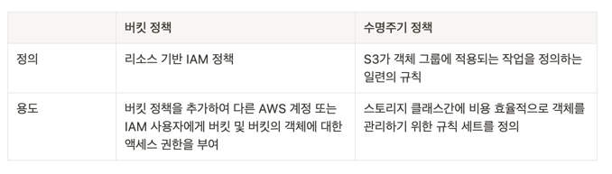
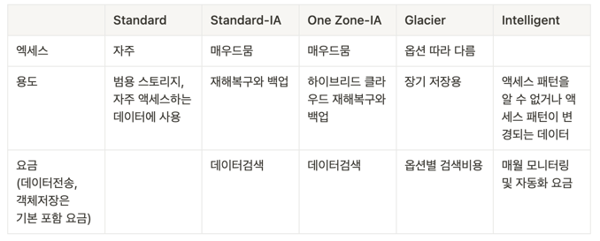

[//]: # "18"

> 개념정리가 아닌 주제별로 시험에 나올 내용들을 정리합니다.

---

 

# S3

- GB당 요금 청구
- 온프레미스에서 엑세스하기 위해선 AWS Storage Gateway를 통해서만 가능
- 버킷이라는 디렉토리에 객체라는 파일로 저장
- 버킷의 이름은 모든 리전, 모든 다른 계정에 걸쳐 고유해야함
- 글로벌 서비스가 아닌 특정 리전에서 생성
- s3://my-bucket/my_folder/another_folder/my_file.txt
- 객체의 최대용량은 5TB
- 5GB이상의 객체를 업로드할 땐 멀티파트를 사용하여 쪼개서 저장시켜야함

## 보안방법

- 사용자 기반 IAM
  - IAM권한이 IAM법칙에 연결되어 역할의 사용자나 그룹이 버킷 엑세스를 허용하거나
  - 버킷이 허용하는 경우
- 리소스 기반 보안 - 버킷 정책
  - 다른 계정의 요청이나 공용요청 등을 허용하거나 거절
- 객체를 암호화하여 수신하거나 해독하지 못하게 함

## 버킷정책

- 버킷 정책은 리소스 기반 AWS Identity and Access Management (IAM) 정책
- JSON기반 정책
  - 리소스 : 어떤 객체와 버킷에 엑세스 권한을 줄 지 정의
  - 액션 : 허용 또는 거부할 API
  - 이펙트 : ALLOW를 하여 Action에 정의한 것들을 허용( | DENY)
  - 프린시펄 : 누구인지에 관한 것

## 수명주기 규칙

- 다음과 같은 동작을 정의하는 규칙 집합
  - 전환 작업 - 객체가 다른 스토리지 클래스로 전환할 시기를 정의
  - 만료 작업 - 객체가 만료되는 시기를 정의
- 수명 주기 구성 규칙을 사용하여 Amazon S3가 객체를 더 저렴한 스토리지 클래스로 전환하거나 아카이브하거나 삭제하도록 지시

## 버킷정채과 수명주기 정책 차이

## S3 Class

## AWS Storage Gateway

- 사실상 무제한의 클라우드 스토리지에 대한 온프레미스 엑세스 권한을 제공하는 하이브리드 클라우드 스토리지 서비스
- 표준 스토리지 프로토콜 세트를 제공하여 기존 애플리케이션을 다시 작성하지 않고 AWS 스토리지를 사용할 수 있음
- 변경된 데이터만 전송하고 데이터를 압축하여 AWS로의 데이터 전송을 최적화함
- IAM으로 리소스를 보호하고 AWS KMS로 데이터를 암호화하고 CloudWatch로 모니터링하며 CloudTrail로 계정의 활동을 로깅함
- 암호화를 자동으로 활성화 함

## S3 Transfer Acceleration

- 클라이언트와 S3 버킷간에 장거리 파일을 빠르고 쉽고 안전하게 전송
- ex
  - 미국에 있는 파일을 호주 s3 버킷에 업로드 할 때
  - 파일을 엣지 로케이션에 업로드하여 미국사용자에게 가깝게 하고
  - 내부 네트워크를 사용하여 엣지로케이션에서 호주 S3버킷으로 파일을 전송

## Amazon S3 ACL(엑세스 제어 리스트)

- 버킷과 객체에 대한 엑세스를 관리
- 각 버킷과 객체마다 하위 리소스로서 연결되어 있는 ACL이 있음

## S3 복제

- 버킷간 객체를 비동기식으로 자동 복제할 수 있게함
  - 메타데이터를 유지
  - 서로 다른 스토리지 클래스로 객체 복제
  - 다른 소유권으로 객체 복사본 유지
  - 15분 이내에 객체 복제
- 객체 복제를 위해 구성된 버킷은 동일한 AWS 계정 또는 다른 계정이 소유할 수 있음
- 다른 AWS 리전 간에, 또는 동일한 리전 내에서 객체를 복사할 수 있음

  ### 교차 리전 복제 (CRR)

  - S3 버킷에서 객체를 비동기식으로 자동 복사하는 기능
  - 다른 AWS리전의 버킷과의 객체를 복사하는데 사용

  ### 동일 리전 복제 (SRR)

  - 같은 리전의 버킷에서 객체를 복사할 때 사용

---

 

# 데이터베이스

## RDS

- 관계형 데이터베이스
- 관리형 데이터베이스 서비스
  - 운영체제 패치를 aws가 수행
  - 지정 시간 복구 가능하도록 지속적인 백업 및 복원할 수 있는 옵션이 존재
  - 모니터링 대시보드 제공
  - 읽기전용 복제본 생성 가능
  - 재해복구 계획 수립하여 대비가능
  - EBS로 구현됨
  - SSH를 실행할 수 없음
- RDS 예약 인스턴스는 1년 또는 3년의 약정 기간에 DB 인스턴스를 예약할 수 있는 옵션을 제공

## RDS Read replicas

- 읽기전용 레플리카(=복제본)을 생성하여 애플리케이션이 읽기작업을 여기서 수행
- 최대 5개의 레플리카(=복제본)을 생성가능
- 쓰기 작업은 오직 메인 데에터베이스에서만 가능

## RDS Multi-AZ (다중 AZ 배포)

- 다른 영역에 레플리카 생성하는 것을 일컬음
- failOver(운영 정지)와 같은 장애조치가 발생했을 때 유용하게 쓰임
- 가용영역에서 충돌이 발생했을 때 높은 가용성을 보장
  - 장애가 발생하면 RDS에서 장애 조치가 트리거 되어 다른 AZ의 DB에서 장애조치를 수행
  - 장애조치 DB는 수동적 DB로 메인 DB에 문제가 발생하기 전까지 엑세스할 수 없음

## 배포방법: 다중리전

- 리전간 데이터를 복제할 때는 데이터를 네트워크를 통해 전송하는 비용이 발생됨

## AWS 오로라

- 클라우드에 최적화되어있음
- RDS보다 20%비쌈
- 읽기 용량과 성능을 확장하도록 3개의 가용 영역에 걸쳐 지연 시간이 짧은 읽기 전용 복제본을 최대 15개까지 추가할 수 있음

## Elastic Cache

- 레디스, 멤캐시트 등
- 높은 성능과 짧은 지연 시간을 자랑하는 인메모리 데이터베이스
- 읽기 집중적인 워크로드의 데이터베이스로부터 워크로드를 줄일 때 용이하게 사용됨
- 일부 데이터를 캐싱처리하여 DB부하를 줄임
- 캐싱, 세션 스토어, 게이밍, 지리공간 서비스, 실시간 분석 및 대기열과 같은 실시간 사용 사례에 많이 선택

## DynamoDB

- 세개의 가용영역에 걸쳐 복제본을 두고 운영됨
- NOSQL
- 분산된 서버리스 데이터베이스
- 검색지연시간이 한 자릿수 밀리초인 성능이 필요할 때 사용

  ### DAX (DynamoDB Accelerator)

  - 다이나모 DB를 위한 완전관리형 인메모리 캐시
  - 성능이 열배 향상됨

## Redshift

- 속도가 빠른 완전관리형 클라우드 데이터 웨어하우스로, 모든 데이터를 표준 SQL 및 기존 BI(비즈니스 인텔리전스) 도구를 사용하여 간편하고 비용 효율적으로 분석
- 정교한 쿼리 최적화, 고성능 스토리지의 열 형식 스토리지, 대량 병렬 쿼리 실행 기능을 사용하여 테라바이트에서 페타바이트 규모의 정형 데이터에 복잡한 분석 쿼리를 실행할 수 있음
- 온라인 트랜잭션 처리에서는 사용하지 않음
- 온라인 분석처리에서 쓰임
- 상시가 아니라 한시간마다 데이터를 로드함
- 데이터를 분석하고 일부연산을 수행하는데에 적합

  ### Amazon Redshift Spectrum

  - Amazon Redshift 테이블에 로드하지 않고도 Amazon S3의 파일에서 정형 및 반정형 데이터를 효율적으로 쿼리하고 검색할 수 있음
  - 대량 병렬 처리를 채택해 대량의 데이터 세트에 대해 매우 빠르게 실행

## Athena

- 표준 SQL을 사용해 Amazon S3에 저장된 데이터를 간편하게 분석할 수 있는 대화식 쿼리 서비스
- 서버리스 서비스이므로 관리할 인프라가 없으며 실행한 쿼리에 대해서만 비용을 지불
- SQL 쿼리 언어를 통해 해당 파일을 생성하면 이들을 따로 로드할 필요없이 s3에 두면 아테나가 분석을 수행함
- Amazon QuickSight를 이용하여 아테나에 대한 보고를 살펴볼 수 있음

## QuickSight

- 서버리스 머신러닝 방식의 비즈니스 인텔리전스 서비스로 대화형 대시보드를 생성

## DocumentDB

- 몽고디비에서 오로라의 역할을 하는 DB
- 몽고디비 기술을 차용하여 만들어져 몽고와 호환이 가능함
- 완전 관리형 데이터베이스

## Neptune

- 그래프 데이터베이스
- 소셜네트워크에 사용됨
- 세개의 AZ에 최대 15개의 읽기 레플리카를 가질 수 있음

## QLDB

- 금융거래를 기록하는 장부의 역할
- 변경이 불가능한 시스템
- 중앙집중형 요소
- 애플리케이션의 모든 변경내역을 살펴볼 때 사용
- Immutable ledger 데이터베이스

## DMS(Database Migration Service)

- 동종 마이그레이션도 지원하고, 이기종 마이그레이션도 지원
- 마이그레이션하는 동안 소스 데이터베이스가 변함없이 운영되어 해당 데이터베이스를 사용하는 애플리케이션의 가동 중지 시간을 최소화할 수 있음

## GLUE

- 관리형 추출, 변환 및 로드 서비스 = ETL 서비스

## Date Pipeline

- 온프레미스 데이터 소스뿐 아니라 여러 AWS 컴퓨팅 및 스토리지 서비스 간에 데이터를 안정적으로 처리하고 지정된 간격으로 이동할 수 있게 지원하는 웹 서비스
- 저장된 데이터에 정기적으로 액세스
- 대규모로 데이터를 변환 및 처리

## Snowball

- 두 가지 옵션으로 제공되는 엣지 컴퓨팅, 데이터 마이그레이션 및 엣지 스토리지 디바이스
- 로컬 스토리지 및 대규모 데이터 전송에 적합

---

 

# 기타 컴퓨팅 서비스

## ECS

- 일레스틱 컨테이너 서비스
- 도커 컨테이너를 실행할 때 사용
- AWS가 컨테이너를 시작하고 중지하는 것을 책임짐
- 어떤 인스턴스에 연결될지를 설정

## EKS

- 관리형 쿠버네티스 서비스
- Kubernetes 컨트롤 플레인의 가용성과 확장성을 관리

## Fargate

- AWS에서 도커 컨테이너를 실행할 때 사용함
- ECS와 EKS 모두에서 작동함
- 서버리스 서비스
- 필요한 컨테이너를 cpu와 ram사양에 맞게 실행시켜줌

## ECR

- 일레스틱 컨테이너 레지스터리
- Docker 컨테이너 이미지를 저장, 관리 및 배포 할 수 있게 함
- 도커이미지를 저장하여 ecs나 fargate에 실행

---

 

# 배치와 람다의 차이

- 배치
  - EC2인스턴스에 의존하기 때문에 시간제약없음
  - 런타임은 도커이미지로 패키징하기만하면 원하는 만큼 가질 수 있음
  - 스토리지는 Ec2에 의존하여 EBS볼륨이 될수도, ec2스토어일수도 있음
  - 서버리스가 아님
  - 다만 aws가 ec2인스턴스를 관리하기 때문에 오토스케일링을 걱정할 필욘 없음
- 람다
  - 람다는 시간제한이 있음 최대 15분
  - 몇개의 프로그래밍언어로만 접근 가능
  - 서버리스여야함
