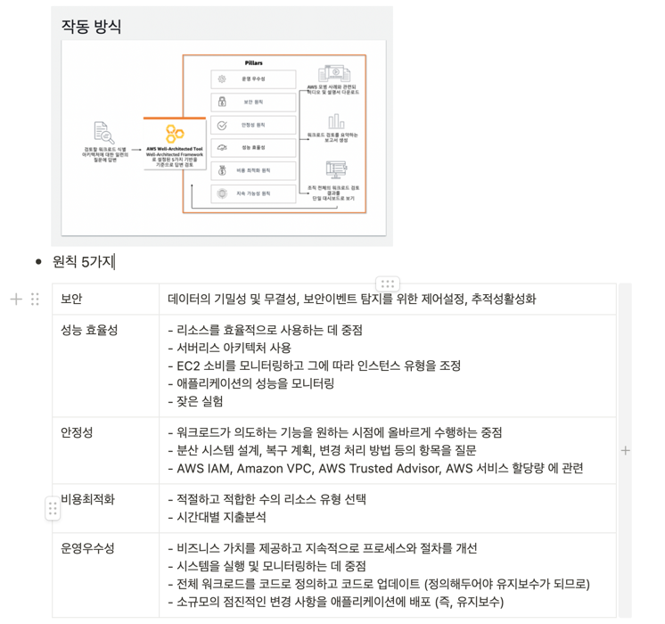
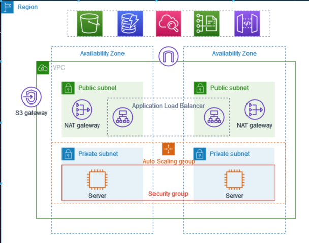

[//]: # "19"

> 개념정리가 아닌 주제별로 시험에 나올 내용들을 정리합니다.

---

 

# 대규모 배포 및 인프라 관리

## Cloudformation

- 클라우드 환경에서 AWS 및 타사 애플리케이션 리소스를 모델링하고 프로비저닝할 수 있도록 공용 언어를 제공
- 프로그래밍 언어 또는 간단한 텍스트 파일을 사용하여 자동화되고 안전한 방식으로 모든 지역과 계정에 걸쳐 애플리케이션에 필요한 모든 리소스를 모델링 및 프로비저닝할 수 있음
- 이미 있는 것을 다시 만들필요없이 기존 템플릿을 이용할 수 있음

## 빈스톡

- 3가지 아키텍쳐
  - 싱글 인스턴스 배포
  - 스케일업 하기위해 로드밸러서와 ASG를 사용
  - ASG만 독립적으로 사용

## CodeDeploy

- 소프트웨어 배포를 자동화하는 도구
- EC2 인스턴스로 실행될 때, 많은 ec2 인스턴스를 v1에서 v2로 업그레이드 할 수 있음
- 온프레미스서버에서 실행될 때 온프레미스에 서버가 있고 애플리케이션 버전 1에서 2로 업그레이드할 수 있음

## Systems Manager

- AWS 서비스의 운영 데이터를 보고 AWS 리소스 전체에서 운영 작업을 자동화할 수 있음
- 리소스를 애플리케이션별로 그룹화하고, 모니터링과 문제 해결을 위해 운영 데이터를 보고, 리소스 그룹에 조치를 취할 수 있음
- 모든 서버에 전체적으로 패치와 구성 및 명령을 실행하도록 함

## CodeCommit

- Git 기반 리포지토리를 호스팅하는 완전관리형 소스 제어 서비스
- 사설 Git 리포지터리에 코드를 저장하도록하며 코드 리포지토리 버전을 관리할 수 있음

## CodeBuild

- 소스 코드를 컴파일하는 단계부터 테스트 실행 후 소프트웨어 패키지를 개발하여 배포하는 단계까지 마칠 수 있는 완전관리형의 지속적 통합 서비스
- 지속적으로 확장되며 여러 빌드를 동시에 처리하기 때문에 빌드가 대기열에서 대기하지 않고 바로 처리
- 기업이 자체적으로 서버 및 소프트웨어를 설정, 패치, 업데이트 및 관리할 필요성을 제거

## CodePipeLine

- 안정적인 애플리케이션 및 인프라 업데이트를 위해 릴리스 파이프라인을 자동화하는 데 도움이 되는 완전관리형 지속적 전달 서비스
- CodePipeline은 코드 변경이 발생할 때마다 사용자가 정의한 릴리스 모델을 기반으로 릴리스 프로세스의 빌드, 테스트 및 배포 단계를 자동화
- GitHub 또는 자체 사용자 지정 플러그인과 같은 타사 서비스와 손쉽게 통합
- AWS내의 파이프라인을 오케스트레이션 할 수 잇음
- 코드 구축 과 테스트에서 배포와 프로비저닝을 할 수 있음

## Well-Architected

- 인프라를 구축하는 클라우드 아키텍트를 돕기 위해 개발된 프레임워크
- 운영 우수성, 보안, 안정성, 성능 효율성 및 비용 최적화 등 다섯 가지 원칙을 기반으로 고객과 파트너에게 일관된 접근 방식을 제공하여 아키텍처를 평가하고, 시간이 흐르면서 확장할 수 있는 설계를 구현하도록 지원
- 

## APN 기술 파트너

- Amazon Web Services를 활용하여 고객을 위한 솔루션과 서비스를 구축하는 기술 및 컨설팅 비즈니스를 위한 글로벌 파트너 프로그램
- 두가지 유형
  - APN 컨설팅 파트너 : 모든 규모의 고객이 AWS에서 새로운 애플리케이션을 설계, 설계, 마이그레이션 또는 구축하도록 지원하는 전문 서비스 회사
  - APN 기술 파트너 : AWS 플랫폼에서 호스팅되거나 통합되는 소프트웨어 솔루션을 제공

---

 

# 글로벌인프라

## Route53

- 라우팅정책
  - 단순 라우팅 정책 : 웹 브라우저가 DNS로 가서 검색하고 IPv4를 얻어옴
  - 가중치 라우팅 정책 : 트래픽을 여러 기관의 인스턴스에 분산
  - 지연시간 라우팅 정책 : 지연시간에 근거하여 라우팅
  - 장애조치 라우팅 정책 : 장애가 발생하면 장애조치 인스턴스로 리다이렉션
  - 지리위치 라우팅 정책 : 사용자의 위치에 기반하여 트래픽 라우팅하려는 경우 사용
  - 지리근접 라우팅 정책 : 리소스의 위치를 기반으로 트래픽을 라우팅
  - 다중응답 라우팅 정책 : DNS쿼리에 무작위로 선택된 최대 8개의 정상 레코드로 응답

## Cloudfront

- 짧은 지연 시간과 빠른 전송 속도로 데이터, 동영상, 애플리케이션 및 API를 전 세계 고객에게 안전하게 전송하는 고속 콘텐츠 전송 네트워크(CDN) 서비스
- 웹사이트 콘탠츠를 캐싱하여 읽기능력을 개선
- AWS 엣지 로케이션(캐싱 콘텐츠가 위치하는 곳을 일컬음)에 위치
- 콘텐츠를 전세계로 분산하여 Ddos로부터 보호
- API 호출뿐만 아니라 WebSocket 트래픽을 보호하고 가속화하는 데 사용될 수 있음
- 원본 액세스 ID는 CloudFront를 통해 프라이빗 콘텐츠를 공유하는 데 사용

## AWS 글로벌 엑셀러레이터

- Amazon Web Service의 글로벌 네트워크 인프라를 통해 사용자 트래픽을 전송하여 인터넷 사용자 성능을 최대 60% 개선하는 네트워킹 서비스
- 글로벌 애플리케이션의 가용성과 성능을 개선할 때 사용
- 애플리케이션의 라우팅을 약 60%정도 최적화
- 2개의 글로벌 정적 고객용 IP를 제공하여 트래픽 관리를 간소화
- 로컬 및 글로벌 트래픽의 네트워크 라우팅을 개선하므로 단일 리전 배포와 다중 리전 배포 간의 차이를 줄이는 데 도움

<aside>
💡 - Global Accelerator 및 Amazon CloudFront는 AWS 글로벌 네트워크와 전 세계에 분포된 해당 엣지 로케이션을 사용하는 별도의 두 서비스입니다. 
- CloudFront는 캐시 가능한 콘텐츠(예: 이미지, 비디오)와 동적인 콘텐츠(예: API 가속화 및 동적 사이트 제공)의 성능을 모두 개선합니다. 
- Global Accelerator는 엣지에서 패킷을 단일 또는 여러 AWS 리전에서 실행되는 애플리케이션으로 프록시하여 TCP 또는 UDP를 통해 광범위한 애플리케이션의 성능을 개선합니다. 
- 두 서비스 모두 DDoS 공격을 막기 위해 AWS Shield와 통합되어 있습니다.

</aside>

## AWS Outposts

- 온프레미스 애플리케이션을 구축할 수 있도록 동일한 AWS인프라, 서비스, API 및 도구를 제공하는 서버랙
- 클라우드에서 실행하는 EC2와 자체데이터센터에서 실행하는 EC2의 차이는 물리적보안 책임을 우리가 져야 하는것
- 시스템에 접근할 때 지연시간이 적음
- 온프레미스에서 outpost로 옮기기 쉬움

---

 

# 클라우드 통합

## SQS : simple queue service

- 마이크로 서비스, 분산 시스템 및 서버리스 애플리케이션을 쉽게 분리하고 확장할 수 있도록 지원하는 완전관리형 메시지 대기열 서비스
- 2가지 종류의 메시지 대기열을 제공
  - 표준 대기열 - 최대 처리량, 최선 노력 순서, 최소 1회 전달을 제공
  - SQS FIFO 대기열 - 메시지가 전송된 정확한 순서대로 정확히 한 번 처리되도록 설계
- 메시지의 기본 유지 기간은 4일이고 최대 14일
- 대기열에 들어올 수 잇는 메시지의 크기는 무제한
- 서버 측 암호화(SSE)를 통해 각 메시지 본문을 암호화하여 애플리케이션 간에 민감한 데이터를 교환할 수 있음
  - Amazon SQS SSE는 AWS Key Management Service(KMS)와 통합되므로 SQS 메시지를 보호하는 키와 다른 AWS 리소스를 보호하는 키를 모두 중앙에서 관리할 수 있음

## SNS

- 하나의 메시지를 다수의 수신자에게 보내고 싶을 때
- pub/sub 구조
- 1200만명 이상의 구독자를 가질 수 있고 계정당 100,000 개의 주제를 가질 수 있음

## SES

- 개발자가 모든 애플리케이션 안에서 이메일을 보낼 수 있는 경제적이고, 확장 가능한 이메일 서비스

## SMS

- 수천 개의 온프레미스 워크로드를 AWS로 좀 더 쉽고 빠르게 마이그레이션할 수 있게 해주는 에이전트 없는 서비스
- 라이브 서버 볼륨의 증분식 복제를 자동화, 일정 예약 및 추적할 수 있으므로 좀 더 쉽게 대규모 서버 마이그레이션을 조정할 수 있음

## AmazonMQ

- Apache ActiveMQ
- 장점은 대기열특징도 있고, pubsub 특징도 있다는 것
- 어떤 회사가 클라우드로 옮길 때 SQS와 SNS를 사용하기 위해 애플리케이션을 어렵게 재설계하는 대신 온프레미스에서 사용하던 프로토콜을 그대로 사용하여 AmazonMQ를 사용할 수 있음
- 애플리케이션에서 메시지 전달을 위해 업계 표준 메시징 프로토콜을 사용해야 하는 경우 사용

---

 

# 클라우드 모니터링

## CloudTrail

- AWS 인프라에서 계정 활동과 관련된 작업을 기록하고 지속적으로 모니터링하며 보관
- Amazon CloudWatch Events와 통합하면 보안 취약성을 초래할 수 있는 이벤트가 탐지될 때 실행되는 워크플로를 정의할 수 있음
- 다음에 대해 추적을 구성할 수 있음
  - 추적을 모든 리전에 적용할지 또는 단일 리전에 적용할지를 지정
  - 로그 파일을 수신할 Amazon S3 버킷을 지정
  - 관리 이벤트 및 데이터 이벤트에 대해 어떤 이벤트(읽기 전용 이벤트, 쓰기 전용 이벤트 또는 모든 이벤트)를 로깅할지 지정
- 모든 고객에 대해 기본적으로 활성화되고 추적을 구성할 필요 없이 지난 7일간의 계정 활동에 대한 가시성을 제공
- 첫 번째 관리 추적에 대해 비용을 청구하지 않고 첫 번째 관리 추적 이후에 생성한 추가 관리 추적에 대해서만 청구

  ### **CloudTrail Insights**

  - CloudTrail 이벤트에 관한 자동화된 분석 제공

  ### CloudTrail Logs

  - CloudTrail을 사용하여 AWS 계정에 대한 AWS API 호출 및 기타 활동을 기록하고 기록된 정보를 선택한 Amazon Simple Storage Service (Amazon S3) 버킷의 로그 파일에 저장
  - 기본적으로 CloudTrail에서 S3 버킷으로 전달하는 로그 파일은 Amazon S3 관리 암호화 키 (SSE-S3)를 사용하는 서버 측 암호화를 사용하여 암호화

## **Amazon X-Ray**

- 개발자가 마이크로 서비스 아키텍처를 사용해 구축된 애플리케이션과 같은 프로덕션 분산 애플리케이션을 분석하고 디버그하는 데 도움
- 사용자 요청이 애플리케이션을 통과하는 전체 과정을 추적

## **Service Health Dashboard**

- AWS가있는 모든 리전에 대해 표 형식으로 모든 AWS 서비스의 상태 및 가용성에 대한 최신 정보를 게시

## **Personal Health Dashboard**

- 클라우드 아키텍처의 일부인 AWS 서비스 상태에 대한 개인화 된보기를 제공하는 서비스
- 배포나 인프라에 직접 영향을 미치는 AWS 이벤트 알림 제공
- AWS에서 사용자에게 영향을 줄 수 있는 이벤트를 경험할 때 알람 및 수정 지침을 제공

<aside>
💡 Service Health Dashboard에 AWS 서비스의 전반적인 상태가 표시되는 반면, 
Personal Health Dashboard는 AWS 리소스의 기반이 되는 AWS 서비스의 성능 및 가용성에 대한 맞춤형 보기를 제공

</aside>

## **CodeGuru**

- 머신 러닝으로 자동화된 코드 검토 실행
- 프로덕션 환경 내 애플리케이션 성능 모니터링
- 애플리케이션 성능 권장 사항 제공 (머신 러닝 활용)

---

 

# VPC

## 리전

- AWS가 전 세계에서 데이터 센터를 클러스터링하는 물리적 위치를 리전이라고 함
- 논리적 데이터 센터의 각 그룹을 가용 영역이라고함
- AWS 리전은 지리적 영역 내에서 격리되고 물리적으로 분리된 여러 개의(두개 이상의) AZ로 구성

## AZ(가용영역)

- 하나 이상의 개별 데이터 센터로 구성
- 단일 데이터 센터를 사용하는 것보다 더 높은 가용성, 내결함성 및 확장성을 갖춘 프로덕션 애플리케이션과 데이터베이스를 운영할 수 있음
- AZ 간에 높은 처리량과 지연 시간이 짧은 네트워킹을 제공
- AZ 간의 모든 트래픽은 암호화

## 로컬 영역

- 사용자와 지리적으로 근접한 AWS 리전의 확장
- 자체 인터넷 연결 기능을 갖추었으며 AWS Direct Connect를 지원
- 로컬 영역에서 생성된 리소스는 로컬 사용자에게 지연 시간이 짧은 통신을 제공할 수 있음

## **VPC 구성 요소**

- VPC: 가상 사설 클라우드
- Subnet: VPC 내의 네트워크 분할, VPC의 IP 주소 범위
- 라우팅 테이블 — 네트워크 트래픽을 전달할 위치를 결정하는 데 사용되는 라우팅이라는 규칙 집합입니다.
- Internet Gateway: VPC와 인터넷간의 통신을 허용하는 수평 확장, 중복 및 고가용성 VPC 구성요소
- NAT Gateway : 사설 서브넷의 인스턴스가 인터넷이나 다른 AWS서비스에 연결할 수 있도록 함, NAT 게이트웨이는 AWS에서 관리하지만 NAT 인스턴스는 사용자가 관리
- Network ACL 또는 NACL: 무상태이며 인바운드 및 아웃바운드 트래픽에 관한 서브넷 수준의 규칙
- Security Group: 상태가 유지되며 EC2 인스턴스 수준에서 실행
- 라우팅 테이블 : 네트워크 트래픽을 전달할 위치를 결정하는 데 사용되는 라우팅이라는 규칙 집합
- VPC 엔드포인트 — 인터넷 게이트웨이, NAT 디바이스, VPN 연결 또는 AWS Direct Connect 연결을 필요로 하지 않고 PrivateLink 구동 지원 AWS 서비스 및 VPC 엔드포인트 서비스에 VPC를 비공개로 연결할 수 있습니다. VPC의 인스턴스는 서비스의 리소스와 통신하는 데 퍼블릭 IP 주소를 필요로 하지 않습니다. VPC와 기타 서비스 간의 트래픽은 Amazon 네트워크를 벗어나지 않습니다.

## **VPC 연결 방식**

- VPC Peering: IP 범위가 겹치지 않고 전이되지 않도록 설정하며, 여러 VPC 간에 연결
- VPC Endpoint: 모든 AWS 서비스를 비공개로 연결하는데 사용
  - 인터페이스 엔드포인트
    - 프라이빗 IP 주소를 가진 탄력적 네트워크 인터페이스
    - 지원되는 서비스로 전달되는 트래픽에 대한 진입점 역할을 하는 서브넷의 IP 주소 범위에 있음
  - 게이트웨이 엔드포인트
    - AWS 서비스로 전달되는 트래픽에 대한 라우팅 테이블에서 경로의 대상으로 지정하는 게이트웨이
    - 다음 AWS 서비스를 지원
      - Amazon S3
      - DynamoDB
- Site-to-Site VPN: 공용 인터넷을 통해 온프레미스 데이터 센터와 AWS 간의 VPC 연결 생성에 사용
- Direct Connect: AWS에 직접 비공개로 연결되며 생성에 약 한 달이 소요
- Transit Gateway
  - 수백 또는 수천 개의 VPC를 온프레미스 네트워크에 전이 방식으로 함께 연결
  - 데이터는 자동으로 암호화되고 퍼블릭 인터넷을 통하지 않음
  - 클라우드 라우터 역할을 하므로 네트워크 아키텍처가 간소화

## **VPC 보안**

- Network ACL
  - 1개 이상의 서브넷 내부와 외부의 트래픽을 제어하기 위한 방화벽 역할을 하는 선택적 보안 계층
  - 보안 그룹과 비슷한 규칙으로 네트워크 ACL을 설정하여 VPC에 보안 계층을 더 추가
- Security Group
  - 인스턴스에 대한 인바운드 및 아웃바운드 트래픽을 제어하는 가상 방화벽 역할
  - 인스턴스에 대한 보안 그룹, 상태가 유지되며 EC2 인스턴스 수준에서 실행
  - VPC에서 인스턴스를 시작할 때 최대 5개의 보안 그룹에 인스턴스를 할당할 수 있음
- Flow Logs
  - VPC와 AWS 클라우드에 들어오고 나가는 모든 네트워크 트래픽의 로그를 얻는데 사용
- Bastion Host 사용
