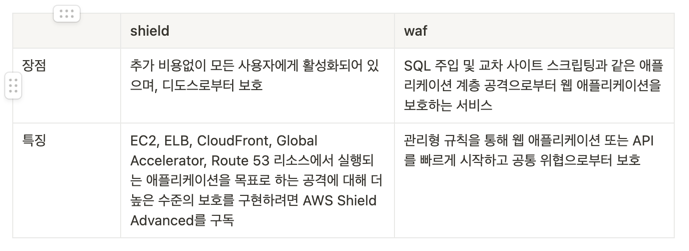
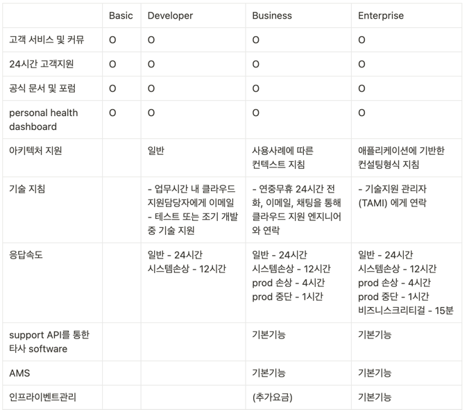

[//]: # "23"

> 개념정리가 아닌 주제별로 시험에 나올 내용들을 정리합니다.

---

 

# 보안 및 규정 준수

## **Shield**

- DDoS 공격을 자동으로 탐지하여 방어하는 기능을 제공
- AWS Shield에는 두 계층 – Standard 및 Advanced가 있음
  - Shield Advance를 사용하면 24시간 지원을 받을 수 있음
  - 모든 AWS 고객은 추가 비용 없이 AWS Shield Standard에 의한 자동 보호를 받을 수 있음
  - AWS Shield Standard는 가장 일반적이고 빈번하게 발생하며 웹 사이트 또는 애플리케이션을 목표로 하는 네트워크 및 전송 계층 DDoS 공격으로부터 보호
  - AWS Shield Standard를 Amazon CloudFront 및 Amazon Route 53과 함께 사용하면, 모든 알려진 인프라(계층 3 및 4) 공격으로부터 가용성을 포괄적으로 보호할 수 있음
  - AWS Shield Advanced는 모든 Amazon CloudFront, AWS Global Accelerator 및 Amazon Route 53 엣지 로케이션에서 사용할 수 있음

## WAF

- Web Application Firewall로, 특정 규칙에 따라 수신 요청을 필터링하는 방화벽
- Amazon CloudFront 배포, Amazon API Gateway REST API 또는 Application Load Balancer에 전달되는 HTTP 및 HTTPS 요청을 모니터링할 수 있게 해주는 웹 애플리케이션 방화벽
  - HTTP 및 HTTPS 요청은 Layer 7인 애플리케이션 계층의 일부
- SQL 주입 또는 사이트간 스크립팅 같은 일반적인 공격패턴을 차단하는 보안 규칙 및 사용자가 정의한 특정 트래픽 패턴을 필터링하는 규칙을 생성하도록 지원
- 지정한 요청을 제외한 모든 요청을 차단할 수 있게 함

  ### Firewall Manager

  - AWS Organization의 여러 계정과 애플리케이션에서 방화벽 규칙을 중앙에서 구성 및 관리할 수 있는 보안 관리 서비스

## WAF와 Shield 차이

## **CloudHSM**

- AWS 클라우드에서 자체 암호화 키를 손쉽게 생성 및 사용할 수 있도록 지원하는 클라우드 기반 하드웨어 보안 모듈

## **Certificate Manager (ACM)**

- SSL, TLS 인증서를 관리, 배포, 프로비저닝하고 전송 중 암호화를 지원
- iam을 사용하여 aws리소스에 ssl사용여부를 설정

## **AWS Artifact**

- 자신에게 해당되는 규정 준수와 관련된 정보를 제공하는 신뢰할 수 있는 중앙 리소스
- PCI, ISO 등과 같은 규정 준수 보고서에 액세스할 수 있음

## **GuardDuty**

- VPC 로그, DNS 로그, 그리고 CloudTrail 로그를 분석하여 악성 행위를 자동으로 발견
- AWS 계정, 워크로드 및 Amazon S3에 저장된 데이터를 보호하기 위해 악의적 활동 또는 무단 동작을 지속적으로 모니터링하는 위협 탐지 서비스

## **Inspector**

- 적시에 의도하지 않은 네트워크 엑세스 가능성과 EC2인스턴스의 취약성을 확인하는데 도움이 되는 자동화된 보안 평가 서비스
- 모범 사례로부터 애플리케이션의 노출, 취약성 및 편차를 자동으로 평가

## **AWS Config**

- AWS 리소스 구성을 지속적으로 모니터링 및 기록하고, 원하는 구성을 기준으로 기록된 구성을 자동으로 평가
- AWS 리소스 간 구성 및 관계 변화를 검토하고, 자세한 리소스 구성 기록을 분석하고, 내부 지침에 지정되어 있는 구성을 기준으로 전반적인 규정 준수 여부를 확인할 수 있음

## **Macie**

- 기계 학습 및 패턴 매칭을 활용하여 AWS에서 민감한 데이터를 검색하고 보호

## **Trusted Advisor**

- 모범 사례에 따라 리소스를 프로비저닝하는 데 도움이 되도록 실시간 지침을 제공하는 온라인 도구
- AWS 환경을 분석하여 다음 5가지 카테고리의 모범 사례 권장 사항을 제공
  1. 비용최적화 : 미사용 및 유휴 리소스를 제거하거나 예약 용량을 약정하여 AWS에서 비용을 절감
  2. 성능 : 서비스 한도를 점검하고 프로비저닝된 처리량을 활용하는지 확인하며 과다 사용되는 인스턴스를 모니터링함으로써 서비스 성능을 개선
  3. 보안 : 결함을 없애고 다양한 AWS 보안 기능을 사용하며 권한을 점검하여 애플리케이션 보안을 개선
  4. 내결함성 : Auto Scaling, 상태 확인, 다중 AZ 및 백업 기능을 활용하여 AWS 애플리케이션의 가용성과 중복성을 향상
  5. 서비스 한도 : 서비스 사용량이 서비스 한도의 80%를 넘는지 점검

## Support 플랜

- 경험이 풍부한 기술 지원 엔지니어가 일대일로 신속한 응답 지원을 제공하는 서비스

## 침투테스트

- AWS 고객은 다음 섹션의 “허용 서비스”에 나열된 8가지 서비스에 대해 사전 승인 없이 AWS 인프라에 대한 보안 평가 또는 침투 테스트를 수행할 수 있음
  - Amazon EC2 인스턴스, NAT 게이트웨이 및 Elastic Load Balancer
  - Amazon RDS
  - Amazon CloudFront
  - Amazon Aurora
  - Amazon API Gateway
  - AWS Lambda 및 Lambda Edge 기능
  - Amazon Lightsail 리소스
  - Amazon Elastic Beanstalk 환경
- 금지활동
  - Amazon Route 53 Hosted Zones를 통한 DNS zone walking
  - 서비스 거부(DoS), 분산 서비스 거부(DDoS), 시뮬레이트 DoS, 시뮬레이트 DDoS(DDoS 시뮬레이션 테스트 정책에 따라 다름)
  - 포트 플러딩
  - 프로토콜 플러딩
  - 요청 플러딩(로그인 요청 플러딩, API 요청 플러딩)

## Resource Access Manager (RAM)

- AWS 계정 또는 AWS 조직 내에서 AWS 리소스를 쉽고 안전하게 공유 할 수있는 서비스
- AWS Transit Gateway, 서브넷, AWS License Manager 구성 및 Amazon Route 53 Resolver 규칙 리소스를 RAM과 공유 할 수 있음

---

 

# 계정 및 요금

## **AWS Organizations**

- 계정 생성을 자동화하고, 비즈니스 요구 사항을 반영하는 계정 그룹을 생성하고, 거버넌스를 위해 이러한 그룹에 정책을 적용할 수 있음
- AWS 데이터 전송 및 Amazon S3 같은 일부 서비스에는 특정 사용량에 따라 서비스를 더 많이 사용하면 낮은 가격을 제공하는 대량 구매 요금 계층이 있어서 통합 청구로 AWS 는 모든 계정의 사용량을 결합하여 적용할 볼륨 가격 계층을 결정하므로 가능한 경우 전체 가격을 낮출 수 있음
- 서비스 제어 정책 (SCP)을 사용하여 AWS Identity and Access Management (IAM) 사용자 및 역할에 권한 가드레일을 적용
- 통합 결제를 통해 조직 내 모든 AWS 계정에 대해 단일 결제 방법을 설정할 수 있음
  - 모든 계정에서 발생한 비용을 통합해서 볼 수 있을 뿐만 아니라 Amazon EC2와 Amazon S3의 볼륨 할인과 같이 집계된 사용량으로 요금 혜택을 누릴 수 있음
  - 통합 결제의 장점:
    - 하나의 청구서 – 여러 계정에 대해 하나의 청구서를 받습니다.
    - 추적 용이 – 여러 계정에 걸쳐 요금을 추적하고 비용 및 사용량 데이터 합계를 다운로드할 수 있습니다.
    - 사용량 통합 – 조직 내 모든 계정에 걸쳐 사용량을 통합하여 대량 구매 요금 할인, 예약 인스턴스 할인 및 Savings Plans를 받을 수 있습니다. 이를 통해 프로젝트, 부서 또는 회사에 청구되는 요금이 개별 계정 요금보다 낮아집니다.
    - 추가 비용 없음 – 통합 결제는 추가 비용 없이 제공됩니다.

## cognito

- 웹과 모바일 앱에 빠르고 손쉽게 사용자 가입, 로그인 및 액세스 제어 기능을 추가할 수 있음
- Amazon Cognito에서는 수백만의 사용자로 확장할 수 있고, Facebook, Google 및 Amazon과 같은 소셜 자격 증명 공급자와 엔터프라이즈 자격 증명 공급자(SAML 2.0 사용)를 통한 로그인을 지원

## 클라우드 애플리케이션 구축 모범사례

1. 실패를 위한 설계
   1. 비관론자가 되도록 권장
   2. 오류로부터 자동화된 복구를 위해 항상 설계, 구현 및 배포
2. 구성 요소 분리
3. 탄력성 구현
   1. 필요에 따라 리소스를 획득하고 더 이상 필요하지 않을 때 리소스를 릴리스하는 기능
4. 병렬 구성
   1. 클라우드를 사용하면 반복 가능한 프로세스를 매우 쉽게 만들 수 있기 때문에 가능한 모든 곳에서 병렬화를 구현할 뿐만 아니라 자동화할 수 있음

## AWS 과금 및 비용 도구 요약:

- Compute Optimizer: 리소스 구성 추천으로 비용 절감
- 요금 계산기(Pricing Calculator): AWS 서비스 비용 예상
- 과금 대시보드: 개요 제공, 프리 티어 대시보드는 프리 티어 사용량 보고
- 비용 할당 태그: 리소스에 태그를 달아 고유한 태그로 상세 보고서 작성
- 비용 및 사용량 보고서
  - AWS 서비스, 요금 및 예약(예: Amazon EC2 예약 인스턴스(RI))에 대한 추가 메타데이터를 비롯하여 사용 가능한 가장 포괄적인 AWS 비용 및 사용 데이터가 포함
  - 사용량 데이터를 일, 시간 또는 월 수준으로 집계하도록 AWS 비용 및 사용 보고서를 사용자 지정할 수도 있음
- 비용 탐색기(Cost Explorer):
  - 현재 사용량 상세히 보여주고 몇 달 전 사용량 예측, 12개월의 데이터를 저장하고 표시
  - 시간에 따른 AWS 비용과 사용량을 시각화, 이해 및 관리할 수 있는 손쉬운 인터페이스를 제공
- 과금 경보: us-east-1에서 전체 및 서비스별 과금 확인 가능
- 예산(Budgets)
  - 사용량, 비용, 예약형 인스턴스를 확인하고 실시간 알림 받기
- Savings Plans: 장기 사용에 따라 특정 금액 약속하여 비용 절감 가능
- TCO Calculator : 기존 데이터 센터가 아닌 AWS를 사용할 때 비용 절감을 추정하는 데 사용

## 비용 발생 원인

- 컴퓨팅
- 스토리지
- 아웃바운드 데이터전송
- !! 때문에 대부분의 경우 동일한 지역 내의 다른 AWS 서비스 간에 인바운드 데이터 전송 또는 데이터 전송에 대한 비용이 발생하지 않음
