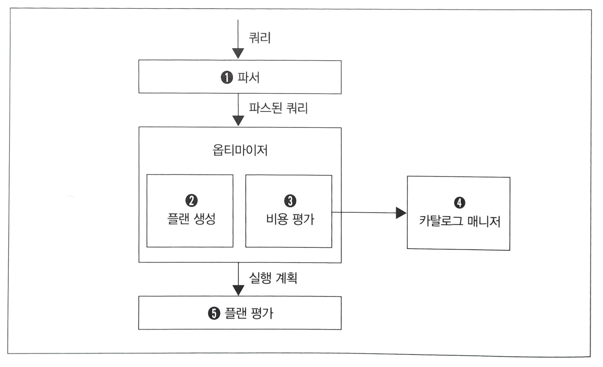

책 : https://www.yes24.com/Product/Goods/24089836

sql공부를 하려고 서점에서 책을 찾던 중 표지가 예뻐 보게되었는데 내용도 좋아 구매를 하게되었습니다.

SQL 첫걸음 이라는 책이 1판인 것 같은데, 평소 SQL을 사용하여 쿼리를 작성해왔지만
간단한 CRUD만 작성해오고 있어서, 진짜로 레벨업을 원하는 사람들에게 필요한 책인 것 같습니다.

책을 읽고, 기초적인 내용보단 '이게 이런 원리였구나' 혹은 '이런 것도 있었어?' 하는 것들을 정리하였습니다.

---

# 데이터베이스의 메모리

DBMS는 다음 두종류의 메모리를 가지는데요.

- 데이터 캐시
- 로그 버퍼

**데이터 캐시**는 데이터 조회 시 디스크에 있는 데이터 일부를 메모리에 유지하기 위해 사용되는 메모리입니다.
> `디스크를 건드리는 자는 불행해진다` 라는 격언이 있다고 합니다.

그래서 데이터 캐시에 데이터가 있다면 저장소까지 데이터를 가지러 갈 필요가 없기에 굉장히 빠릅니다.

<br>

**로그 버퍼**는 데이터 command 기능과 관련이 있는데요.

> command는 INSERT, DELETE, UPDATE 를 의미했습니다.

DBMS는 command 요청을 받으면 즉각 데이터를 변경하지 않고, 로그 버퍼에 둔 후 비동기로 처리를 합니다.
이유는 데이터 갱신은 처리 시간이 많이 소모되는 작업이기에 이걸 처리한 뒤 응답을 하기에는 많은 시간이 걸리기 때문인데요.

여기서 의문이 들 수 있는 부분은 그럼 끝났다라는 응답을 준 뒤 메모리가 날라가버리면 어떻게 되나? 인데요.

이 때문에, 커밋 시점에는 갱신 정보를 영속적인 저장소에 write를 하게 됩니다.

이를 통해 정합성을 유지할 수 있게됩니다.


# DBMS가 데이터에 접근하는 플로우



### 파서

파서는 SQL 구문을 검사합니다.

syntax 에러가 나는 것은 모두 파서에서 발견된 에러입니다.


### 옵티마이저

옵티마이저는 실행계획을 작성해주는 모듈입니다.

### 카탈로그 매니저

옵티마이저가 실행계획을 작성하기 위해선 여러가지 정보가 필요한데요.

인덱스 유무, 데이터 분산 정도, 편향 정도, 매개변수 등 이러한 정보들을 카탈로그 매니저가 옵티마이저에게 제공합니다.

### 플랜평가

옵티마이저가 만든 실행 계획 중 최적의 결과를 선택하는 모듈입니다.


# CASE

case식은 switch와 유사하다고 생각하면 이해하기 쉽습니다.

```roomsql
select
    CASE WHEN name = 'a' then '알파'
         WHEN name =' b' then '베타'
         ELSE '감마'
    END
from student;
```

위 쿼리를 설명하자면, `student`라는 테이블에 name 컬럼의 값이 `a`라면 `알파`를 출력,
`b`라면 `베타`를 출력
이외에는 `감마`를 출력하는 쿼리입니다.


# WHERE이 아닌 SELECT 에서 조건 분기를 하기

```roomsql
select created_at as time
from student
where nickname = 'a'
union
select modified_at as time
from student
where nickname = 'b';
```

이 쿼리의 문제점은 두번의 쿼리가 실행된다는 것입니다.

쿼리가 여러번 요청된다는 것은 I/O가 그만큼 n배로 발생된다는 것이므로 성능 저하를 유발할 수 있습니다.

> 조건 분기를 WHERE 구로 하는 사람들은 초보자다. 라고 하네여

해서, 다음과 같이 CASE를 사용하여 한번의 쿼리로 개선할 수 있습니다.

```roomsql
select 
    case when nickname = 'a' then created_at
         when nickname = 'b' then modified_at
    end as time
from student;
```

요령으로는 이 문제를 절차지향 언어로 해결한다면 어떤 if문을 사용할까를 이것을 SQL의 case로는 어떻게 해결할 수 있지를
꾸준히 의식하는 것입니다.

# 집계 분기도 CASE 사용하기

| 지역 | 성별 | 인구 |
| --- | --- | --- |
| 성남 | 남 | 10 |
| 성남 | 여 | 20 |
| 수원 | 남 | 10 |
| 수원 | 남 | 30 |
| 광명 | 여 | 20 |

위와 같은 데이터가 있을 때 

아래와 같은 출력을 만들기 위해선 어떻게 해야할 까요?

| 지역 | 남자 | 여자 |
| --- | --- | --- |
| 성남 | 10 | 20 |
| 수원 | 40 | 0 |
| 광명 | 0 | 20 |


===================================

서브쿼리와 union을 사용하는 방법이 있겠지만 <br>
case를 사용하면 단 한번의 쿼리 그리고 숏쿼리가 가능해집니다.

```roomsql
select
    prefecture,
    sum(case when sex='남' then 인구 else 0 end) as '남자',
    sum(case when sex='여' then 인구 else 0 end) as '여자'
from population
group by prefecture;
```

# UNION

> union은 지양하자!

이 책에서 계속해서 강조하는 말입니다.

**하지만** union이 꼭 나쁘기만 한것은 아닙니다.

다음과 같이 union을 사용할 수 밖에 없는 상황들이 있습니다.

1. 머지 대상이 되는 select 구문들에서 사용하는 테이블이 다른경우

    - 이러한 경우는 별다른 방법이 없어, union을 사용해야만 합니다.

2. union을 사용하는 것이 성능이 더 좋은 경우
    
    - union을 사용했을 때 인덱스를 타고, 그렇지 않을 땐 풀스캔을 한다면 당연히 union을 사용하는 것이 좋습니다.
    - 대표적으로, union을 사용하지 않기 위해 `or`, `in`, `case`를 사용했는데 쿼리는 한번이지만 풀스캔이 발생한다면
    차라리 여러번의 쿼리가 발생하지만 인덱스가 적용되는 union을 사용하는것이 낫습니다.


# IF문

책에 나오지 않는 내용이지만, case 뿐 아니라 if문도 사용이 가능하다는 것을 알게되어
함께 정리했습니다.

```roomsql
select id,
       if(nickname = 'a', '알파', null) as korean_name,
       if(nickname = 'a', 'alpha', null) as english_name,
       if(nickname = 'b', '베타', null) as korean_name,
       if(nickname = 'b', 'beta', null) as english_name
from student
group by nickname;
```

# 윈도우 함수

윈도우 함수는 집약함수 뒤에 OVER 구를 작성하고, 내부에 자를 키를 지정하는 PARTION BY 또는 ORDER BY 를 입력합니다.

### PARTITION BY

GROUP BY에서 자르기만 진행하고 집약은 빠진 기능이라고 보시면 됩니다.

```roomsql
select 
    count(*)
from student
group by nickname;
```

만약 위 쿼리의 결과가

| 이름 | 수  |
| --- |----|
| a | 2  |
| b | 3  |
| c | 1  |

와 같다면  

```roomsql
select 
    count(*) over (partition by nickname)
from student;
```

이 쿼리의 결과는 어떻게 다를까요?

바로 아래와 같습니다.

| 이름 | 수   |
| --- |-----|
| a | 2   |
| a | 2   |
| b | 3   |
| b | 3   |
| b | 3   |
| c | 1   |

이유는 말했다시피, 집약기능이 제외되고 자르기 기능만 있기 때문입니다.

count 외에도 다음과 같은 윈도우 함수로 사용할 수 있는 함수들이 있습니다.

- SUM
- RANK
- DENSE RANK

# 윈도우함수로서 ORDER BY

PARTION BY와 동일하게 사용하시면 됩니다.

# 결합

결합은 거의 100% 실무에서 사용이 될 수 밖에 없는데요.

결합의 성능이 좋으려면 구동 테이블의 레코드 한개에 내부 테이블의 레코드 한개가 대응하고, 해당 레코드를 내부 테이블의 인덱스를 사용해 찾을 수 있는 경우가 만족되어야 합니다.

구동 테이블이란 결합 대상 테이블이며, 구동테이블은 옵티마이저가 최적의 실행계획에 따라 결정을 하게 됩니다.

최적의 실행계획은 "구동테이블이 작고 내부테이블 결합키에 인덱스가 존재하는 경우" 라는 조건에 따라 실행 비용을 최소화하는 방향으로 결정합니다.

왜냐하면 내부 테이블이 클수록 인덱스 사용으로 인한 반복 생략 효과가 커지기 때문입니다.

> 해서, 우리는 인덱스를 설정할 때 어떤 테이블을 내부 테이블로 하고, 어떤 결합 키에 인덱스를 작성해야 하는지를 초기 단계에 잘 고민해야합니다.

# 서브쿼리를 사용하는 것이 좋은 경우

결합할 때는 최대한 결합 대상 레코드 수를 줄이는 것이 중요한데요.

옵티마이저가 이를 잘 판별하지 못하는 경우가 있어, 이럴때는 직접 연산 순서를 명시하여 성능을 높일 수도 있습니다.

예를들어, 집약과 결합을 하는경우 집약 후 결합을 할지 또는 결합 후 집약을 할 지 선택해야합니다.
집약 후 결합을 하게되면 레코드 수가 감소하여 결합비용이 낮아지게 됩니다.

다만, 어느 쪽이 빠른지는 환경에 따라 다르기에 성능을 테스트하고 판단을 내리는것이 더 좋습니다.


