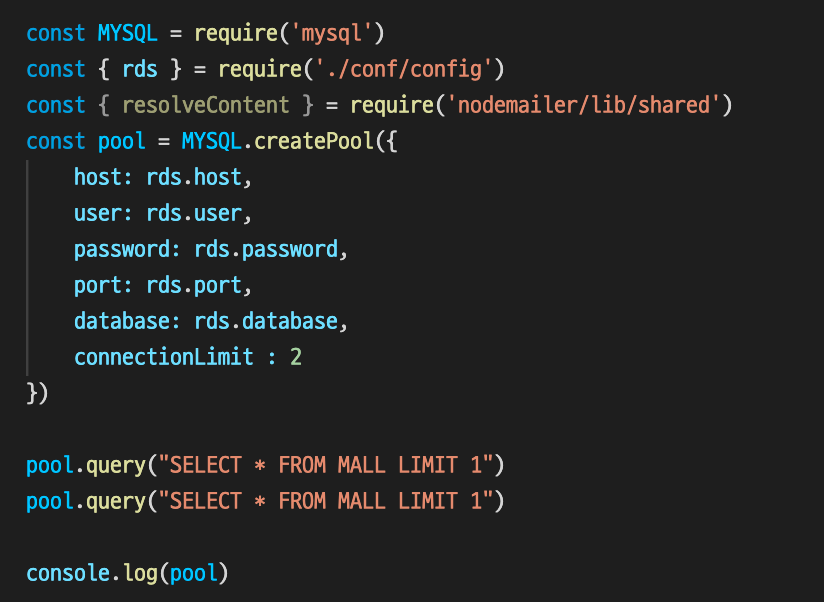
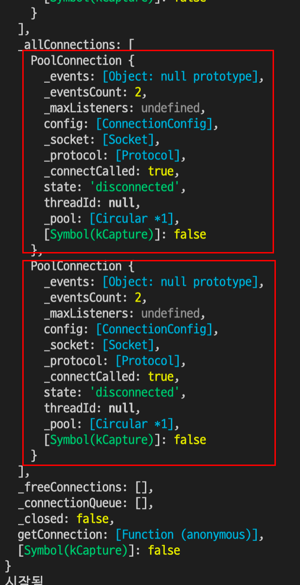
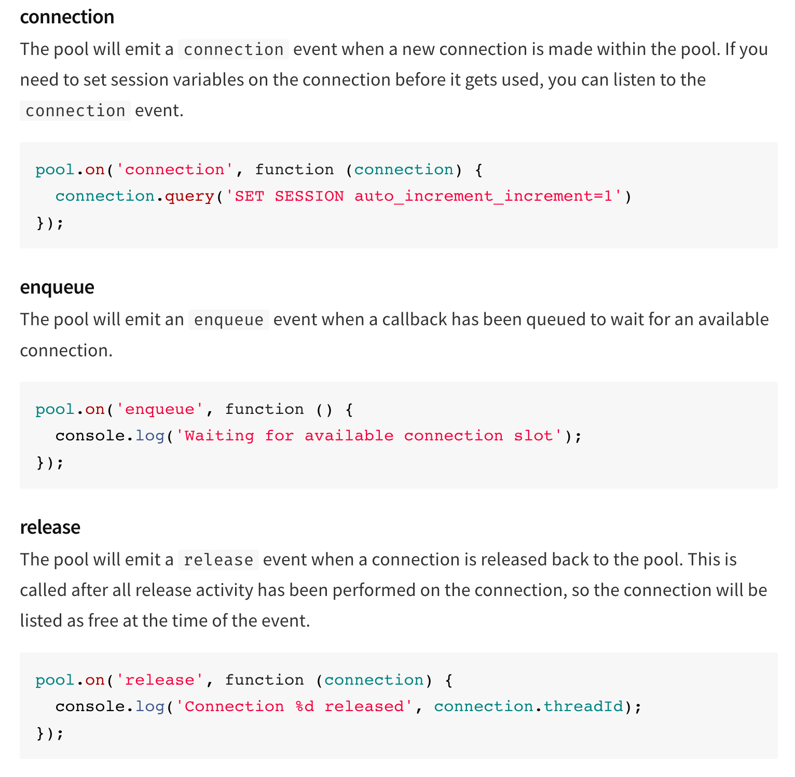
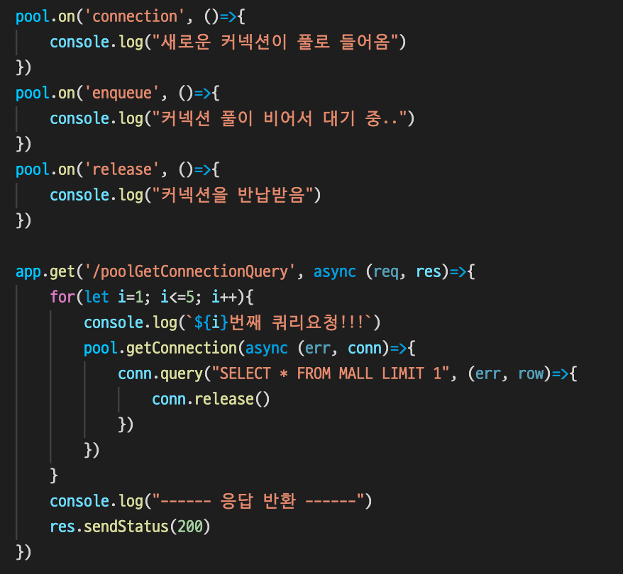
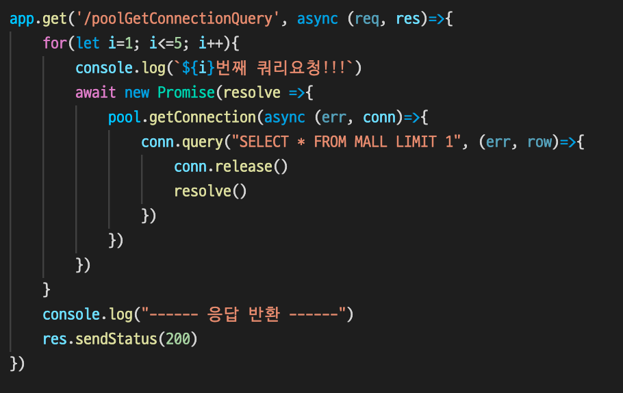
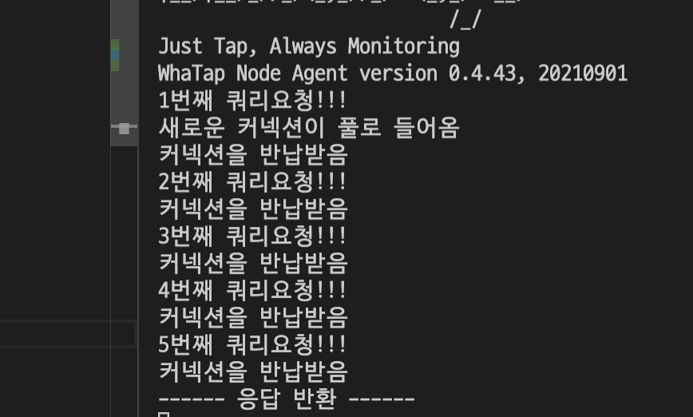

[//]: # "11"

# 커넥션 풀
 
DB 드라이버의 커넥션풀이 정상적으로 잘 실행되고 있나 확인했던 과정을 기록해두려 합니다.

커넥션풀에 대한 좋은 참고자료도 함께 공유합니다.

- https://jojoldu.tistory.com/634
- https://jojoldu.tistory.com/714

 

mysql 드라이버의 커넥션풀 분석

서버가 데이터베이스와 통신하기 위해서는 다음 5단계를 거칩니다.

1. 데이터베이스 드라이버를 사용하여 데이터베이스 커넥션 Open
2. 데이터 읽기/쓰기를 위한 TCP 소켓 Open
3. 소켓을 통한 데이터 읽기/쓰기
4. 커넥션 Close
5. 소켓 Close

때문에 매 통신마다 커넥션을 새로 생성하는 것은 비효율적이므로, 대부분의 db 드라이버는 커넥션 풀을 통해 효율적으로 커넥션을 사용합니다.

## 커넥션 풀이란?

connection pool을 지원하는 db 드라이버는 생성되는 커넥션을 close하지 않고 Connection Pool이라는 객체에 저장을 해둡니다.
이후 서버가 db에 요청을 보내려하면 pool에 저장해둔 커넥션을 빌려주고 다시 반납을 받는 식으로 동작하게 됩니다.

이때 처음 서버가 시작되면 필요할 때마다 커넥션을 생성하고 생성된 커넥션은 풀에 저장시키다가, 풀 사이즈만큼의 커넥션이 생성되면 이후부터는 생성을 금지하고 풀에 저장된 커넥션만을 재사용합니다. (nodejs의 mysql이 아닌 다른 어떤 드라이버는 서버가 시작될 때 일단 커넥션을 먼저 생성해둔다고도 합니다.)

## mysql 드라이버의 pool 객체 살펴보기

커넥션풀이 어떻게 커넥션을 담고있는지 보겠습니다.

pool이 생성되고 설정한 사이즈(2)만큼 커넥션이 생성될 수 있게 두번의 쿼리를 날린 후 pool에 어떤 값이 담겨있는 지 출력해보았습니다.

콘솔에 출력된 내용을 보면 pool 객체에는 두 개의 커넥션이 저장되어 있습니다.
다음에 쿼리를 날릴 때는 새로 커넥션 객체를 생성하고 소켓연결과 다른 통신을 위한 작업을 할 필요없이 위 커넥션 객체를 가져다가 재사용하면 됩니다.

## 커넥션 풀의 모든 커넥션이 사용중이라면?

만약 커넥션 풀에 있는 커넥션이 모두 사용되고 있는데 다음 db 요청이 들어오면 어떻게 될까요?

db 요청은 커넥션 풀에서 커넥션을 가져와 사용합니다. 그리고 작업이 끝나면 사용한 커넥션을 커넥션풀에 반납합니다. 따라서 커넥션풀이 비어있는 경우 다음 요청들은 커넥션이 반납되어 풀에 다시 돌아올 때 까지 대기하다가, 풀에 커넥션이 반납되면 바로 그것을 가져가 사용합니다.

nodejs mysql 라이브러리는 기본적으로 풀을 사용하여 default size가 10으로 설정되어있습니다.

따라서 DB가 맺을 수 있는 커넥션과 서비스의 트래픽 그리고 nodeJS서버라면 pm2로 몇개의 서버를 동시 실행 시키는 지를 고려하여 적절한 pool size를 직접 설정해주는 것이 좋습니다.

 

# 커넥션풀 사용중인지 확인해보기

mysql라이브러리 문서에서는 pool에서 발생하는 이벤트를 트리거할 수 있는 기능을 설명해주고 있습니다.

이것을 이용하여 커넥션이 어떻게 생성되고 반납되고 있는지 확인해보겠습니다.

먼저 이벤트별로 콘솔에 어떤 이벤트가 발생됐는지를 출력하는 트리거 함수를 설정했습니다.
그리고 `/poolGetConnectionQuery` 로 요청을 보낸 후 콘솔을 확인해보겠습니다.

커넥션풀이 잘 사용되고 있네요.
로그를 하나하나 분석해보겠습니다.

pool size가 2이기 때문에 2번째 요청까지는 커넥션풀에 커넥션을 요구하지 않지만, 3번째 요청부터는 커넥션 풀에서 커넥션을 가져와 재사용하기로 정해져있고 커넥션풀은 비어있는 상태이므로 대기에 빠지면서 대기 로그를 남깁니다.

그 사이 mysql 드라이버는 1,2번째 쿼리 요청을 위해 새로운 커넥션 2개를 만들기 시작합니다. 때문에 이 쿼리들을 대기 상태로 분류하지 않습니다.(대기 상태 요청은 큐에 담기는데 여기에 넣지 않는 다는 의미입니다.)

그리고 커넥션을 만드는동안 비동기 동작으로 인해 3,4,5번째 쿼리 요청들이 호출된 후 대기 상태에 빠지고 응답이 반환되어 버립니다.

하지만 생성 중이던 커넥션은 응답여부와 상관없는 비동기 작업이므로 다음 작업을 계속 이어갑니다.

커넥션이 생성되면 그것을 바로 사용하는 것이 아닌 먼저 커넥션풀에 넘겨줍니다.
그리고 나서 1번째, 2번째 쿼리가 커넥션을 가져가 사용한 후 반납하고 3,4,5번째는 반납되는 커넥션을 가져가 재사용한 후 반납하는 동작이 차례로 발생하여 5번의 커넥션을 반납받음로그가 연속으로 남는 것을 볼 수 있습니다.

## 비동기를 동기로 전환하여 다시 확인해보기

`Promise`를 사용하여 비동기코드를 동기코드로 전환했습니다.

콘솔의 결과를 보면, 플로우는 다음과 같습니다.

쿼리요청 → 풀에서 사용가능한 커넥션을 체크 → 비어있음을 확인하고 새 커넥션 생성 → 커넥션 반납 → 다음 요청 발생 -> 풀에 반납된 커넥션을 가져가 사용한 후 반납하기를 반복

여기서 새로운 사실을 알 수 있습니다.

커넥션을 새로 생성하는 기준은 서버가 시작한 이래로 몇 번째 요청인가가 아니라, 요청이 커넥션을 요구할 때 풀에 커넥션이 있는가 입니다.
즉, pool size는 단지 최대로 생성할 커넥션 수 이며 커넥션 수가 이 값을 넘어가면 풀에 사용가능한 커넥션이 없어도 새로 생성하지 않도록 제한하기 위한 정책임을 알 수 있습니다.
