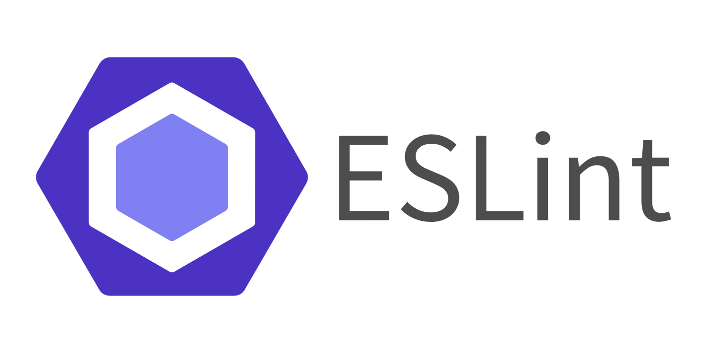

ESLint는 JavaScript 코드에서 잠재적인 버그, 스타일 문제, 일반적인 오류를 찾고 식별하기 위해 사용되는 정적 분석 도구입니다. 정적 분석이란 코드를 실행하지 않고도 소스 코드를 검사하여 잠재적인 문제를 찾는 프로세스를 의미합니다.

ESLint는 주로 개발자들이 일관된 코드 스타일을 따르도록 도와주며, 버그와 잠재적인 오류를 식별하기 위한 규칙도 제공합니다.

<br>

<br>

<br>

# 타입스크립트에서 ESLint 사용하기

```json
{
  "parser": "@typescript-eslint/parser",
  "plugins": ["@typescript-eslint"],
  "extends": ["plugin:@typescript-eslint/recommended"]
}
```

parser는 TypeScript를 지원하는 ESLint 파서를 사용하도록 지정합니다.

plugin은 TypeScript 플러그인을 활성화하는것이며,

extends 설정은 ESLint에서 사용할 규칙 세트를 지정합니다. `eslint:recommended`는 ESLint의 기본 규칙 세트를 의미하고, `plugin:@typescript-eslint/recommended`는 `@typescript-eslint` 플러그인의 권장 규칙 세트를 사용합니다.

린트 명령은 `npm eslint --ext .ts src/`로 ext옵션으로 .ts 확장자를 지정하고, 린팅할 디렉토리를 명시해서 사용합니다.

<br>

<br>

<br>

# 필요한 규칙이 없다면?

사용자 정의 규칙을 작성하여 커스텀한 lint를 사용할 수 있습니다.

- 사용자 정의 규칙 작성:
  ESLint에서 사용자 정의 규칙을 작성하기 위해 다음 세 가지 요소가 필요합니다:

  - Rule ID: 규칙을 식별하는 고유한 문자열입니다. 예를 들어, "my-custom-rule"과 같은 형식을 사용할 수 있습니다.
  - Rule Definition: 규칙의 동작을 정의하는 JavaScript 함수입니다. 이 함수는 코드 노드를 받아들이고, 규칙 위반을 확인하고, 문제를 보고하는 역할을 합니다.
  - Rule Options: 필요에 따라 규칙에 전달되는 옵션을 정의할 수 있습니다.

  예를 들어, 사용자 정의 규칙을 작성해보겠습니다. "my-custom-rule"이라는 규칙을 만들어 문자열 길이가 주어진 값보다 큰지 확인하는 규칙으로 정의합니다:

  ```jsx
  // my-custom-rule.js
  module.exports = {
    meta: {
      type: "suggestion",
      docs: {
        description:
          "Ensure that strings have a length greater than the specified value",
        category: "Best Practices",
        recommended: true,
      },
      fixable: null,
      schema: [
        {
          type: "integer",
          minimum: 1,
        },
      ],
    },
    create(context) {
      const minimumLength = context.options[0] || 1

      return {
        Literal(node) {
          if (
            typeof node.value === "string" &&
            node.value.length <= minimumLength
          ) {
            context.report({
              node,
              message: `String literals should have a length greater than ${minimumLength}`,
            })
          }
        },
      }
    },
  }
  ```

  위의 예시에서는 `meta` 객체를 사용하여 규칙의 메타데이터와 옵션 스키마를 정의하고, `create` 메서드를 사용하여 규칙의 동작을 구현합니다.

- 사용자 정의 규칙 적용:
  사용자 정의 규칙을 적용하기 위해 다음 단계를 따를 수 있습니다:

  - 사용자 정의 규칙 파일을 프로젝트에 추가합니다. 예를 들어, 프로젝트 루트 디렉토리에 `my-custom-rule.js` 파일을 생성합니다.
  - 프로젝트에 ESLint를 설치합니다 (만약 아직 설치되지 않았다면). `npm install eslint --save-dev`를 실행하여 설치할 수 있습니다.
  - `.eslintrc.json` 파일에서 규칙을 추가합니다.

    ```jsx
      {
        "rules": {
          "my-custom-rule": ["error", 5]
        },
        "plugins": ["./path/to/my-custom-rule"]
      }
    ```

    위의 예시에서는 `"my-custom-rule"` 규칙을 `"error"` 수준으로 설정하고, 문자열 길이를 5로 설정하였습니다. `"plugins"` 배열에는 사용자 정의 규칙 파일이 위치한 경로를 지정해야 합니다.
