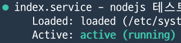

회사에 devops 분이 계실 때는 aws 이벤트를 항상 관리해주셨었는데요.
devops 분이 퇴사하신 이후 aws 이벤트 알림을 아무도 신경쓰지 않고 있었습니다.

그러던 어느 날, 갑자기 포스사에서 연동이 되지 않고 있다는 이슈가 인입되었습니다.

확인해보니 pm2로 실행되던 서버들이 모두 종료가 되어있었습니다.
여차저차 얼른 서버를 재구동시키고, nginx도 재시작해주었습니다.

원인 파악을 위해 모니터링 기록을 찾아봤는데
에러가 발생해서 서버가 죽었는지(사실 에러가 발생해도 죽지 않는 구조이지만), 메모리가 꽉 차서 죽었는지 도통 원인이 파악이 안되었습니다.

찾다찾다 인프라 에러 슬랙 채널까지 확인을 해보니 해당 일자 새벽 시간에 서버 재시작이 예정되어 있다는 알림이 와있었습니다.

인프라 에러 채널 알림은 누가 어디에 접근했는지, 어디선가 배포가 있었는지, 새로운 s3 버킷이 등록되었는지 등등
많은 인프라 이벤트에 대하여 알림을 받고 있어 개발자들이 해당 채널에 대한 주의도가 많이 떨어져있는 상태였습니다.

그래서 다음과 같이 두가지로 재발 방지 대책을 세웠는데요.

1. 서버가 재시작되면 필수 프로세스들을 함께 재시작할 수 있게 자동화한다.
2. 크리티컬한 에러를 한 곳에서 확인하여 빠른 대응을 할 수 있도록 개선해야한다.

사실 두번째는 예전부터 의견을 제시해왔지만 당장의 개선 사항은 아니라며 계속 미뤄졌습니다.

여튼 첫번째 대책을 실현하기 위해 systemd를 사용했는데요.
pm2와 systemd 조합으로 재부팅 시 pm2가 자동으로 서버들을 start할 수 있도록 설정을 해두었습니다.

이때 공부한 systemd가 신기해서 이를 사용하여 리눅스에 nodejs 서버를 한번 띄워보고자 합니다.
단순 system 사용기 라기 보단, 리눅스를 처음부터 세팅해서 nodejs서버를 안전하게 띄우는 걸 쭉 정리해 볼 생각입니다.

<br>

<br>

# 히스토리 관리

<br>

`history`는 최근에 많이 사용하고 있는 명령언데요.

누가 언제 어떻게 설정을 바꿨는지 히스토리 관리가 잘 안되다보니 이 명령어를 통해 확인하는 경우가 많습니다.

~~그래도 추측하기 힘들어요..~~ <br>
~~저의 능력 부족... ㅠㅠ~~

```shell
vi /etc/profile

### HISTTIMEFORMAT="%Y-%m-%d_%H:%M:%S [CMD]:" 입력

source /etc/profile
```


<br>

<br>

# 기본 패키지 설치

<br>

```shell
sudo apt update

sudo apt install nodejs

echo "var http = require('http');
var app = http.createServer(function(req, res){
	res.end('hi');
});
app.listen(8080);" > index.js;

```

nodejs를 설치하고 테스트를 위해 요청이오면 hi를 응답하는 index.js를 구성했습니다.

```shell
nohup node index.js &
curl http://localhost:8080
```

nohup은 프로세스를 실행한 터미널의 세션 연결이 끊기더라도 프로세스를 계속해서 동작시키는 명령어입니다.
로그아웃 등과 같이 세션 연결이 끊기더라도 프로세스가 계속 동작될 수 있도록 합니다. 
하지만 Ctrl+C를 누르면 프로세스는 바로 종료되는데요.

반면 백그라운드(&) 실행은 실행 시키면 대기 상태가 없지만, 세션 연결이 끊기면 실행한 프로그램도 함께 종료됩니다.

해서, 두개를 함께 사용합니다.

하지만 이 역시 재부팅시 실행했던 프로세스가 자동으로 재실행되지는 않기에 저희는 systemd가 필요한것입니다.

<br>

<br>

# 시간 설정

<br>

```shell
sudo ln -sf /usr/share/zoneinfo/Asia/Seoul /etc/localtime

date
```

date를 입력해보면 현재 시간이 한국 시간으로 변경된 것을 확인할 수 있습니다.

하지만 여기까지만 하면 시간에 대하여 신뢰를 할 수가 없습니다.

하드웨어 시간만으로는 정확한 시간을 측정할 수 없기에 시간이 조금씩 밀립니다. 
그러다보면 나중에는 몇분에서 몇십분까지 차이가 나는 경우가 있기 때문에
`crony`라는 것을 사용하여 시간을 계속 동기화해주는 것이 좋습니다.

```shell
sudo apt install chrony

sudo systemctl status chrony
```


이런 결과가 나온다면 정상적으로 설치 및 동작이 되고 있는 것입니다.

결과가 다르다면 아래 명령어를 입력해주면 됩니다.

```shell
sudo systemctrl enable chrony
sudo systemctrl start chrony
```

벌써 여기서 systemd를 잠깐이나마 사용하게 되었네요.

<br>

<br>

# systemd

<br>

드디어 마지막 과제에 도달했습니다.

돌아돌아 이것저것해서 여기까지 왔네요.

systemd(system daemon)은 전통적으로 Unix 시스템이 부팅후에 가장 먼저 생성된 후에 다른 프로세스를 실행하는 init 역할을 대체하는 데몬입니다.
deamon은 background에서 실행이 되는  프로세스입니다.

이전에는 init이라는 데몬이 있었는데 이를 대체하고 init보다 기능이 추가되어서 나온 것이 systemd입니다. 그래서 이전의 init과 같이 PID가 1이 됩니다. 부모프로세스가 없으므로 PPID 또한 1이 됩니다.

먼저 systemd로 index.js를 실행시킬 것이기에 nohup으로 실행시켜둔 프로세스를 종료합니다.

```shell
ps -ef | grep index
<br>

### pid 확인

sudo kill {위에서 확인한 pid}
```

systemd의 아키텍처는 매우 복잡하지만
일반 리눅스 사용자 입장에서는 최상단의 systemd utillities 인 
systemctl, journalctl 등 유틸리티 사용법만 익히면 됩니다.

때문에 먼저 명령어 부터 스리슬쩍 확인해보겠습니다.

## systemctl

### 서비스 상태 확인

`systemctl status 서비스명`

### 서비스 구동

`systemctl start 서비스명`

### 서비스 자동 시작

`systemctl enable 서비스명`

### 서비스 리스트

`sudo systemctl list-units`

## journalctl

리눅스용 시스템/서비스 매니저인 systemd 는 로그 데이타를 journal 이라는 바이너리 형식으로 저장합니다.

journalctl 은 저널에서 로그를 검색하고 볼 수 있는 유틸리티입니다.

### 기본 보기

옵션없이 journalctl 을 실행하면 systemd 의 로그를 볼 수 있습니다.

`journalctl`

### 최근 메시지만 보기

7개의 최근 로그 메시지를 보여줍니다.
`journalctl -n 7`

### 마지막 라인 표시

journalctl -x -e


### 특정 PID 저널만 보기

`journalctl -n _PID=872`

### 날짜/시간으로 필터링

` journalctl --since 2020-01-09`

`journalctl --since 2020-01-09 --until 2020-01-11`

`journalctl --since "-2hour" --until "10min"`


## nodejs 시스템 등록하기

이제 명령어도 어느정도 알았으니 본격적으로 nodejs를 시스템에 등록을 해보겠습니다.

### 서비스 파일 작성

(서비스이름).service 파일을 만들어줍니다.

```shell
### index.service
[Unit]
Description=nodejs 테스트

[Service]
ExecStart=node /home/user/index.js
Restart=always
Group=nogroup
Environment=NODE_ENV=development
WorkingDirectory=/home/user/

[Install]
WantedBy=multi-user.target
```

### 시스템 등록

```shell
sudo systemctl link /home/user/index.service
```

### 시스템 자동시작 및 구동

```shell
sudo systemctl enable index
sudo systemctl start index
```

### 상태확인

```shell
sudo systemctl status index
```



이런식으로 나타나면 성공입니다.

정말 시스템이 재시작되어도 서버가 구동이 되는지 확인해보겠습니다.

```shell
sudo reboot

curl http://localhost:8080
```


성공!

인프라를 직접 건드리는 일이 많아지다보니 새롭게 배우는 것이 많은데요.

그래서 다음에는 또 새롭게 배우게된 swap에 대해 정리해볼까 합니다.


